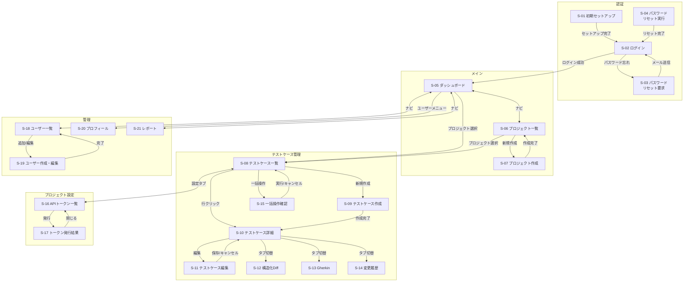

# TMS 画面一覧・画面遷移図

## このドキュメントについて

ユースケース（docs/usecase.md）の全フローを実現するために必要な画面を洗い出し、画面間の遷移関係を定義する。

現設計スペックの UI 定義（§6）は 3 画面のみ（プロジェクト一覧、テストケース一覧、テストケース詳細）。本ドキュメントではユースケースを満たすために必要な全画面を列挙する。設計スペックに未定義の画面は `[※]` で明示する。

---

## 画面一覧

全 21 画面。設計スペック定義済みは 3 画面、新規追加は 18 画面。

| ID | 画面名 | 種別 | 対応 UC | スペック |
|---|---|---|---|---|
| S-01 | 初期セットアップ | ページ | UC-02 | [※] |
| S-02 | ログイン | ページ | UC-03 | [※] |
| S-03 | パスワードリセット要求 | ページ | UC-27 | [※] |
| S-04 | パスワードリセット実行 | ページ | UC-27 | [※] |
| S-05 | ダッシュボード | ページ | UC-22 | [※] |
| S-06 | プロジェクト一覧 | ページ | UC-04, UC-29 | 定義済み |
| S-07 | プロジェクト作成 | ダイアログ | UC-04 | 定義済み(一覧内) |
| S-08 | テストケース一覧 | ページ | UC-07〜12,14,16〜19 | 定義済み |
| S-09 | テストケース作成 | ページ | UC-08, UC-09 | [※] |
| S-10 | テストケース詳細 | ページ | UC-10,11,13,15,20,21,28 | 定義済み |
| S-11 | テストケース編集 | ページ内モード | UC-10, UC-13 | 定義済み(詳細内) |
| S-12 | 構造化 Diff ビュー | タブ | UC-15 | 定義済み(詳細内) |
| S-13 | Gherkin ビュー | タブ | UC-20 | 定義済み(詳細内) |
| S-14 | 変更履歴 | タブ | UC-21 | 定義済み(詳細内) |
| S-15 | 一括操作確認 | ダイアログ | UC-12 | [※] |
| S-16 | API トークン一覧 | ページ | UC-06, UC-24 | [※] |
| S-17 | トークン発行結果 | ダイアログ | UC-06 | [※] |
| S-18 | ユーザー一覧 | ページ | UC-05, UC-25 | [※] |
| S-19 | ユーザー作成・編集 | ダイアログ | UC-05, UC-25 | [※] |
| S-20 | プロフィール・パスワード変更 | ページ | UC-26 | [※] |
| S-21 | レポート・エクスポート | ページ | UC-23 | [※] |

**種別の定義:**
- **ページ:** 独立した URL を持つ全画面表示
- **タブ:** 親ページ内のタブ切替で表示
- **ダイアログ:** 親ページ上にオーバーレイ表示。操作完了後に閉じる
- **ページ内モード:** 同一ページの表示/編集モード切替

---

## 共通レイアウト

### グローバルヘッダー `[※]`

全認証済みページに共通のヘッダー。

```
┌─────────────────────────────────────────────────────────────┐
│ TMS ロゴ    [ダッシュボード] [プロジェクト]                  │
│                                    [ユーザー管理(admin)]     │
│                                    ○ 田中太郎 ▼             │
│                                      ├ プロフィール         │
│                                      └ ログアウト           │
└─────────────────────────────────────────────────────────────┘
```

- ナビゲーション: ダッシュボード、プロジェクト一覧
- ユーザー管理リンク（admin ロールのみ表示）
- ユーザーメニュー（プロフィール、ログアウト）

### プロジェクトコンテキストヘッダー `[※]`

プロジェクト配下の画面に表示。プロジェクト内のナビゲーション。

```
┌─────────────────────────────────────────────────────────────┐
│ ← プロジェクト一覧    payment-service                       │
│ [テストケース] [API トークン(admin)] [設定(admin)]           │
└─────────────────────────────────────────────────────────────┘
```

### パンくずリスト `[※]`

現在位置を示す。プロジェクト配下の深い階層で特に必要。

```
プロジェクト > payment-service > テストケース > 有効期限切れカードで決済を試みると...
```

### 通知・トースト `[※]`

操作結果のフィードバック。画面右上に一時表示。

- 成功: 「テストケースを承認しました」「トークンを発行しました」
- エラー: 「更新が競合しました。最新の内容を確認してください」（OCC 409）
- 警告: 「このテストケースを編集すると、以後 Discovery による自動更新が停止します」

---

## 各画面の詳細

### S-01 初期セットアップ `[※]`

**目的:** デプロイ直後に最初の管理者アカウントと組織を作成する。
**表示条件:** 組織が 0 件のとき（初回アクセス時のみ）。
**対応 UC:** UC-02

```
┌──────────────────────────────────────┐
│         TMS セットアップ             │
│                                      │
│  組織名       [________________]     │
│                                      │
│  管理者メール [________________]     │
│  パスワード   [________________]     │
│  パスワード確認[________________]    │
│  表示名       [________________]     │
│                                      │
│          [セットアップ開始]          │
└──────────────────────────────────────┘
```

**要素:**
- 組織名入力
- 管理者情報（メール、パスワード、表示名）
- セットアップ実行ボタン

**遷移先:** セットアップ完了 → S-02 ログイン

---

### S-02 ログイン

**目的:** ユーザーがシステムにログインする。
**対応 UC:** UC-03

```
┌──────────────────────────────────────┐
│            TMS ログイン              │
│                                      │
│  メール     [________________]       │
│  パスワード [________________]       │
│                                      │
│  [パスワードを忘れた場合]            │
│                                      │
│            [ログイン]                │
└──────────────────────────────────────┘
```

**要素:**
- メールアドレス入力
- パスワード入力
- ログインボタン
- パスワードリセットリンク `[※]`
- エラー表示（認証失敗時）

**遷移先:** ログイン成功 → S-05 ダッシュボード（または S-06 プロジェクト一覧）

---

### S-03 パスワードリセット要求 `[※]`

**目的:** パスワードを忘れたユーザーがリセットを要求する。
**対応 UC:** UC-27

**要素:**
- メールアドレス入力
- 送信ボタン
- 「送信しました」メッセージ（メールアドレスの存在有無に関わらず同じ表示）

**遷移先:** S-02 ログインに戻る

---

### S-04 パスワードリセット実行 `[※]`

**目的:** リセットリンクから新しいパスワードを設定する。
**対応 UC:** UC-27

**要素:**
- 新しいパスワード入力
- パスワード確認入力
- 設定ボタン

**遷移先:** パスワード設定完了 → S-02 ログイン

---

### S-05 ダッシュボード `[※]`

**目的:** プロジェクト横断でテスト管理状況を俯瞰する。ログイン後の最初の画面。
**対応 UC:** UC-22

```
┌──────────────────────────────────────────────────────────┐
│ ダッシュボード                                           │
│                                                          │
│ ┌─────────────┐ ┌─────────────┐ ┌─────────────┐         │
│ │ テスト総数   │ │ 未レビュー  │ │ 要対応      │         │
│ │    342       │ │    28       │ │    12       │         │
│ │              │ │ (machine    │ │ (drift: 8   │         │
│ │ approved:280 │ │  +draft)    │ │  stale: 4)  │         │
│ │ draft: 50    │ │             │ │             │         │
│ │ archived: 12 │ │             │ │             │         │
│ └─────────────┘ └─────────────┘ └─────────────┘         │
│                                                          │
│ プロジェクト別サマリー                                   │
│ ┌────────────────────────────────────────────────┐       │
│ │ プロジェクト    approved  draft  drift  stale  │       │
│ │ payment-service   120     15      3      1     │       │
│ │ user-service       95     20      4      2     │       │
│ │ order-service      65     15      1      1     │       │
│ └────────────────────────────────────────────────┘       │
│                                                          │
│ 最近のアクティビティ                                     │
│  14:30  田中  payment-service  テストケース承認 (5件)    │
│  13:15  CI    user-service     Discovery同期完了          │
│  11:00  佐藤  order-service    drift解消                  │
└──────────────────────────────────────────────────────────┘
```

**要素:**
- 全体サマリーカード（テスト総数、未レビュー数、要対応数）
- プロジェクト別サマリーテーブル（クリックでプロジェクトに遷移）
- 最近のアクティビティフィード
- 各数値はクリックで該当フィルタ適用済みのテストケース一覧に遷移 `[※]`

**遷移先:**
- プロジェクト名クリック → S-08 テストケース一覧
- サマリー数値クリック → S-08 テストケース一覧（フィルタ適用済み）`[※]`

---

### S-06 プロジェクト一覧

**目的:** プロジェクトの一覧表示と新規作成。
**対応 UC:** UC-04, UC-29

```
┌──────────────────────────────────────────────────────────┐
│ プロジェクト一覧                     [+ 新規作成(admin)] │
│                                                          │
│ ┌────────────────────────────────────────────────┐       │
│ │ 名前               リポジトリ        テスト数  │       │
│ │ payment-service     github.com/...      135    │       │
│ │ user-service        github.com/...      115    │       │
│ │ order-service       github.com/...       81    │       │
│ └────────────────────────────────────────────────┘       │
└──────────────────────────────────────────────────────────┘
```

**要素:**
- プロジェクトテーブル（名前、リポジトリ URL、テストケース数）
- 新規作成ボタン（admin のみ表示）→ S-07 ダイアログ
- 各行クリックで S-08 テストケース一覧に遷移

**遷移先:**
- プロジェクト行クリック → S-08 テストケース一覧
- 新規作成 → S-07 プロジェクト作成ダイアログ

---

### S-07 プロジェクト作成ダイアログ

**目的:** 新しいプロジェクトを作成する。
**実行者:** admin
**対応 UC:** UC-04

```
┌──────────────────────────────────┐
│ プロジェクト作成                 │
│                                  │
│ プロジェクト名 [______________]  │
│ リポジトリ URL [______________]  │
│               (任意)             │
│                                  │
│        [キャンセル] [作成]       │
└──────────────────────────────────┘
```

**遷移先:** 作成完了 → S-06 プロジェクト一覧（トースト通知）

---

### S-08 テストケース一覧

**目的:** プロジェクト配下のテストケースを一覧・検索・フィルタし、一括操作を行う。TMS の中核画面。
**対応 UC:** UC-07, UC-08, UC-10, UC-12, UC-14, UC-16, UC-17, UC-18, UC-19

```
┌──────────────────────────────────────────────────────────────────┐
│ ← payment-service   テストケース (135)       [+ 新規作成]       │
│                                                                  │
│ フィルタ:                                                        │
│ [ステータス ▼] [カテゴリ ▼] [所有権 ▼] [drift ▼] [stale ▼]     │
│ [target: _______________] [検索: _______________]                │
│                                                                  │
│ ┌ 同期サマリー (最終同期: 2026-06-28 13:15) ─────────────────┐  │
│ │ 新規: 3件  drift: 2件  stale: 1件                          │  │
│ └────────────────────────────────────────────────────────────┘  │
│                                                                  │
│ [☐ 全選択]  選択中: 0件  [承認 ▼]                               │
│ ┌──────────────────────────────────────────────────────────────┐│
│ │☐ タイトル                    target          cat.  status    ││
│ │☐ 有効カードで決済成功        Payment#charge  正常  approved  ││
│ │☐ 期限切れカードでエラー      Payment#charge  異常  draft  ⚡ ││
│ │☐ 金額0円で決済               Payment#charge  境界  draft     ││
│ │☐ DB接続失敗時リトライ        Payment#charge  ｴﾗ-  approved 🔺││
│ │☐ 削除済みユーザーで決済      Payment#charge  異常  draft  👻 ││
│ └──────────────────────────────────────────────────────────────┘│
│                                                                  │
│                        [< 前へ] [次へ >]                         │
└──────────────────────────────────────────────────────────────────┘

バッジ凡例: ⚡ = drift（コード乖離）  🔺 = stale（未観測）  👻 = machine所有
```

**要素:**

フィルタパネル:
| フィルタ | 選択肢 | スペック |
|---|---|---|
| ステータス | draft / approved / archived / 全て | 定義済み |
| カテゴリ | normal / abnormal / boundary / error_handling / 全て | 定義済み |
| 所有権 | machine / human / 全て | [※] |
| drift | あり / なし / 全て | [※] |
| stale | あり / なし / 全て | [※] |
| target | テキスト入力（部分一致） | [※] |
| フリーテキスト検索 | テキスト入力（タイトル・Given/When/Then） | [※] |

テーブル:
| 列 | 内容 |
|---|---|
| チェックボックス | 一括操作用 `[※]` |
| タイトル | テストケース名。クリックで詳細遷移 |
| target | 対象クラス・メソッド |
| カテゴリ | アイコンまたは略称 |
| ステータス | バッジ表示 |
| 所有権 | machine/human アイコン `[※]` |
| drift バッジ | 乖離検知時に表示 |
| stale バッジ | 未観測時に表示 |
| 更新日時 | `[※]` |

同期結果サマリー `[※]`:
- 最終同期日時
- 新規・drift・stale の件数（クリックでフィルタ適用）

一括操作バー `[※]`:
- 全選択 / 選択解除
- 選択件数の表示
- 操作メニュー（承認 / アーカイブ / ステータス変更）→ S-15 確認ダイアログ

ページング:
- カーソルベース（前へ / 次へ）

**遷移先:**
- テストケース行クリック → S-10 テストケース詳細
- 新規作成ボタン → S-09 テストケース作成
- 一括操作 → S-15 一括操作確認ダイアログ

---

### S-09 テストケース作成 `[※]`

**目的:** テストケースを手動で新規作成する。
**実行者:** editor 以上
**対応 UC:** UC-08, UC-09

```
┌──────────────────────────────────────────────────────────┐
│ テストケース作成                                         │
│                                                          │
│ タイトル   [________________________________________]    │
│ 対象       [________________________________________]    │
│            (例: com.example.PaymentService#charge)        │
│ カテゴリ   [正常系 ▼]                                    │
│                                                          │
│ ── Given（事前条件）──────────────────────────────────   │
│ [                                                    ]   │
│ [                                                    ]   │
│                                                          │
│ ── When（操作）───────────────────────────────────────   │
│ [                                                    ]   │
│ [                                                    ]   │
│                                                          │
│ ── Then（期待結果）───────────────────────────────────   │
│ [                                                    ]   │
│ [                                                    ]   │
│                                                          │
│ ── パラメータ（任意）────────────────────────────────   │
│ │  name    │  inputs        │  expected              │   │
│ │  [____]  │  [__________]  │  [__________________]  │   │
│ │  [____]  │  [__________]  │  [__________________]  │   │
│ │                              [+ 行を追加]          │   │
│                                                          │
│ ── メタデータ（任意）────────────────────────────────   │
│ タグ  [payment] [card-validation] [+ 追加]               │
│                                                          │
│                      [キャンセル] [下書き保存] [作成]    │
└──────────────────────────────────────────────────────────┘
```

**要素:**
- タイトル入力
- target 入力（任意。クラス・メソッドの参照）
- カテゴリ選択（ドロップダウン）
- Given/When/Then テキストエリア
- パラメータテーブル（動的行追加）
- メタデータ入力（タグのトークン入力）`[※]`
- 作成ボタン（draft/human で保存）

**遷移先:** 作成完了 → S-10 テストケース詳細

---

### S-10 テストケース詳細

**目的:** テストケースの全情報を閲覧し、ステータス変更・drift 対応等の操作を行う。
**対応 UC:** UC-10, UC-11, UC-13, UC-15, UC-16, UC-20, UC-21, UC-28

```
┌──────────────────────────────────────────────────────────────┐
│ ← テストケース一覧                                           │
│                                                              │
│ 有効期限切れカードで決済を試みるとエラーが返る                │
│ ステータス: [draft ▼]  所有権: human                         │
│ [drift ⚡ 解消する]  [stale 🔺 origin-1]                     │
│                                                [編集]        │
│                                                              │
│ [基本情報] [Gherkin] [構造化Diff] [変更履歴] [Identity情報]  │
│ ─────────────────────────────────────────────────────────    │
│                                                              │
│ 対象:     com.example.PaymentService#charge                  │
│ カテゴリ: 異常系                                             │
│                                                              │
│ Given:                                                       │
│   有効期限が過去のカード情報が登録されている                  │
│                                                              │
│ When:                                                        │
│   そのカードで 1,000 円の決済を実行する                       │
│                                                              │
│ Then:                                                        │
│   決済が拒否され、エラーコード CARD_EXPIRED が返る            │
│                                                              │
│ パラメータ: なし                                             │
│                                                              │
│ メタデータ:                                                  │
│   タグ: [payment] [card-validation]                          │
│   作成元: discovery                                          │
│                                                              │
│                                          [アーカイブ]        │
└──────────────────────────────────────────────────────────────┘
```

**ヘッダー要素:**
| 要素 | 内容 |
|---|---|
| タイトル | テストケース名 |
| ステータス | draft / approved / archived。ドロップダウンで変更可能（editor 以上） |
| 所有権 | machine / human の表示 |
| drift バッジ | 表示時に「解消する」（accept-fingerprint）ボタンを併設 |
| stale バッジ | 表示時にどの origin が stale かを表示 |
| 編集ボタン | 編集モード（S-11）に切替。editor 以上 |
| アーカイブボタン | ステータスを archived に変更。editor 以上 |
| 復帰ボタン `[※]` | archived 時のみ表示。draft に戻す |

**タブ:**
- 基本情報（デフォルト）
- Gherkin ビュー（S-13）
- 構造化 Diff（S-12、drift 時のみアクティブ）
- 変更履歴（S-14）
- Identity 情報 `[※]`

**遷移先:**
- 編集ボタン → S-11 編集モード
- 各タブ → S-12, S-13, S-14 タブ切替
- アーカイブ → 確認後、S-08 一覧に戻る

---

### S-11 テストケース編集（ページ内モード）

**目的:** テストケースの内容を編集する。
**実行者:** editor 以上
**対応 UC:** UC-10, UC-13

S-10 の基本情報タブがフォームに切り替わる。

**要素:**
- タイトル、target、カテゴリ、Given/When/Then、パラメータ、メタデータの編集フォーム（S-09 と同等のフィールド）
- 現在の version 表示（OCC 用）
- 保存ボタン / キャンセルボタン

**machine 所有時の警告 `[※]`:**
```
⚠ このテストケースは現在 Discovery が自動管理しています。
  編集すると以後 Discovery による自動更新が停止し、
  コード側の変化は drift として検知されるようになります。
  [編集を続ける] [キャンセル]
```

**OCC 競合時:**
- 409 エラーの場合、「他のユーザーが先に更新しました。最新の内容を確認してください」と表示
- 最新内容の再読み込みボタン

**遷移先:** 保存完了 → S-10 詳細表示に戻る

---

### S-12 構造化 Diff ビュー（タブ）

**目的:** drift が発生したテストケースについて、canonical（現在の仕様）と最新の観測の差分を構造化表示する。
**対応 UC:** UC-15

```
┌──────────────────────────────────────────────────────────┐
│ [基本情報] [Gherkin] [構造化Diff ●] [変更履歴]           │
│ ─────────────────────────────────────────────────────    │
│                                                          │
│ canonical（現在の仕様）  ←→  最新の観測                  │
│ origin: discovery-ci  観測日時: 2026-06-28 13:15         │
│                                                          │
│ Given:                                                   │
│ - カート内に商品が1点ある                                │
│ + カート内に商品が1点以上ある                             │
│                                                          │
│ When:                                                    │
│   （変更なし）                                           │
│                                                          │
│ Then:                                                    │
│ - 合計金額が表示される                                   │
│ + 合計金額と送料が表示される                             │
│                                                          │
│ Parameters:                                              │
│   （変更なし）                                           │
│                                                          │
│ [accept-fingerprint: この観測を正として受け入れる]        │
└──────────────────────────────────────────────────────────┘
```

**要素:**
- canonical と最新 committed 観測のフィールド単位の diff 表示
- 観測元 origin と日時の表示
- accept-fingerprint ボタン（指紋を受け入れて drift 解消）

---

### S-13 Gherkin ビュー（タブ）

**目的:** テストケースを Gherkin 形式で整形表示する。仕様共有用。
**対応 UC:** UC-20

```
┌──────────────────────────────────────────────────────────┐
│ [基本情報] [Gherkin ●] [構造化Diff] [変更履歴]           │
│ ─────────────────────────────────────────────────────    │
│                                                          │
│ Feature: 決済処理                                        │
│                                                          │
│   Scenario: 有効期限切れカードで決済を試みると           │
│             エラーが返る                                 │
│     Given 有効期限が過去のカード情報が登録されている      │
│     When そのカードで 1,000 円の決済を実行する            │
│     Then 決済が拒否され、エラーコード                    │
│          CARD_EXPIRED が返る                              │
│                                                          │
│                         [クリップボードにコピー]         │
│                         [エクスポート]                    │
└──────────────────────────────────────────────────────────┘
```

**要素:**
- Gherkin 形式のテキスト表示
- クリップボードコピーボタン `[※]`
- エクスポートボタン（.feature ファイル） `[※]`

---

### S-14 変更履歴（タブ）

**目的:** テストケースの変更経緯を時系列で確認する。
**対応 UC:** UC-21

```
┌──────────────────────────────────────────────────────────┐
│ [基本情報] [Gherkin] [構造化Diff] [変更履歴 ●]           │
│ ─────────────────────────────────────────────────────    │
│                                                          │
│ 2026-06-28 14:30  田中 (editor)  ステータス変更          │
│   status: draft → approved                               │
│                                                          │
│ 2026-06-28 14:25  田中 (editor)  更新                    │
│   then: "エラーが返る"                                   │
│       → "エラーコード CARD_EXPIRED が返る"               │
│   category: normal → abnormal                            │
│                                                          │
│ 2026-06-28 10:00  token:discovery-ci  取り込み           │
│   (初回取り込み)                                         │
│                                                          │
│                        [もっと見る]                       │
└──────────────────────────────────────────────────────────┘
```

**要素:**
- 時系列の変更エントリ（日時、実行者、操作種別、差分）
- 差分は変更フィールドの before/after 表示
- ページング（もっと見る / スクロール）

---

### S-15 一括操作確認ダイアログ `[※]`

**目的:** 一括承認・一括アーカイブ等の確認。
**対応 UC:** UC-12

```
┌──────────────────────────────────────┐
│ 一括操作の確認                       │
│                                      │
│ 15 件のテストケースを                │
│ 「承認」しますか？                   │
│                                      │
│ ・所有権が machine のテストケースは   │
│   human に遷移します                 │
│ ・以後 Discovery の自動更新が         │
│   停止します                         │
│                                      │
│         [キャンセル] [実行]          │
└──────────────────────────────────────┘
```

---

### S-16 API トークン一覧 `[※]`

**目的:** プロジェクトの API トークンを管理する。
**実行者:** admin
**対応 UC:** UC-06, UC-24

```
┌──────────────────────────────────────────────────────────┐
│ API トークン                                 [+ 発行]    │
│                                                          │
│ ┌──────────────────────────────────────────────────────┐ │
│ │ 名前           作成日       最終使用     状態        │ │
│ │ discovery-ci   2026-06-01   2026-06-28   有効        │ │
│ │ test-gen-dev   2026-06-15   2026-06-20   有効        │ │
│ │ old-token      2026-01-10   2026-03-01   失効済み    │ │
│ └──────────────────────────────────────────────────────┘ │
│                                                          │
│ ※ トークンの平文は発行時に1回だけ表示されます            │
└──────────────────────────────────────────────────────────┘
```

**要素:**
- トークンテーブル（名前、作成日、最終使用日時、状態）
- 発行ボタン → S-17 ダイアログ
- 各行に失効ボタン（確認ダイアログ付き）
- 平文やハッシュは表示しない

**遷移先:** 発行ボタン → S-17 トークン発行結果ダイアログ

---

### S-17 トークン発行結果ダイアログ `[※]`

**目的:** 発行されたトークンの平文を 1 回だけ表示する。
**対応 UC:** UC-06

```
┌──────────────────────────────────────────────────┐
│ トークンが発行されました                         │
│                                                  │
│ ⚠ この画面を閉じると平文は二度と表示できません   │
│                                                  │
│ ┌──────────────────────────────────────────────┐ │
│ │ tms_a3Bx9kLm2pQr5tUv8wYz...               │ │
│ │                            [コピー]         │ │
│ └──────────────────────────────────────────────┘ │
│                                                  │
│ 名前: discovery-ci                               │
│ プロジェクト: payment-service                    │
│                                                  │
│                            [閉じる]             │
└──────────────────────────────────────────────────┘
```

**要素:**
- トークン平文の表示（1 回限り）
- コピーボタン
- 閉じるボタン（閉じると平文は永久に取得不可）

---

### S-18 ユーザー一覧 `[※]`

**目的:** 組織内のユーザーを管理する。
**実行者:** admin
**対応 UC:** UC-05, UC-25

```
┌──────────────────────────────────────────────────────────┐
│ ユーザー管理                                [+ 追加]     │
│                                                          │
│ ┌──────────────────────────────────────────────────────┐ │
│ │ 表示名     メール              ロール    最終ログイン│ │
│ │ 田中太郎   tanaka@example.com  admin    2026-06-28   │ │
│ │ 佐藤花子   sato@example.com    editor   2026-06-27   │ │
│ │ 鈴木一郎   suzuki@example.com  viewer   2026-06-25   │ │
│ └──────────────────────────────────────────────────────┘ │
└──────────────────────────────────────────────────────────┘
```

**要素:**
- ユーザーテーブル（表示名、メール、ロール、最終ログイン `[※]`）
- 追加ボタン → S-19 ダイアログ
- 各行クリックで S-19 編集ダイアログ

---

### S-19 ユーザー作成・編集ダイアログ `[※]`

**目的:** ユーザーの新規作成またはロール変更。
**実行者:** admin
**対応 UC:** UC-05, UC-25

```
┌──────────────────────────────────────┐
│ ユーザー追加                         │
│                                      │
│ メール     [____________________]    │
│ 表示名     [____________________]    │
│ ロール     [editor ▼]               │
│ 初期パスワード [________________]    │
│                                      │
│         [キャンセル] [追加]          │
└──────────────────────────────────────┘
```

**編集モード（既存ユーザー）:**
- ロール変更ドロップダウン
- パスワードリセットボタン（管理者手動リセット）
- ユーザー無効化ボタン `[※]`
- 注意: ロール変更時は全セッション無効化される旨の警告

---

### S-20 プロフィール・パスワード変更 `[※]`

**目的:** 自分のプロフィール確認とパスワード変更。
**対応 UC:** UC-26

```
┌──────────────────────────────────────────────────────────┐
│ プロフィール                                             │
│                                                          │
│ 表示名:   田中太郎                                       │
│ メール:   tanaka@example.com                             │
│ ロール:   admin                                          │
│                                                          │
│ ── パスワード変更 ────────────────────────────────────   │
│ 現在のパスワード [________________]                       │
│ 新しいパスワード [________________]                       │
│ パスワード確認   [________________]                       │
│                                                          │
│                             [パスワードを変更]           │
└──────────────────────────────────────────────────────────┘
```

---

### S-21 レポート・エクスポート `[※]`

**目的:** テスト管理の状況をレポート・エクスポートする。
**対応 UC:** UC-23

```
┌──────────────────────────────────────────────────────────┐
│ レポート                        プロジェクト: [全て ▼]   │
│                                                          │
│ ── ステータス別集計 ─────────────────────────────────    │
│ ┌────────────────────────────────────────────────┐       │
│ │ [■■■■■■■■■■■■■■■■■■■■] approved: 280          │       │
│ │ [■■■■■]                 draft: 50              │       │
│ │ [■■]                    archived: 12           │       │
│ └────────────────────────────────────────────────┘       │
│                                                          │
│ ── カテゴリ別分布 ───────────────────────────────────    │
│ 正常系: 120  異常系: 95  境界値: 80  エラーハンドリング: 47│
│                                                          │
│                              [CSV エクスポート]          │
└──────────────────────────────────────────────────────────┘
```

**要素:**
- プロジェクト選択フィルタ
- ステータス別集計（グラフ + 数値）
- カテゴリ別分布
- drift / stale の発生件数と推移 `[※]`
- CSV エクスポートボタン

---

## 画面遷移図

### 全体遷移図



### ユースケース別遷移フロー

#### フロー A：初回導入（UC-02 → UC-06）

```
S-01 初期セットアップ
  ↓ セットアップ完了
S-02 ログイン
  ↓ ログイン成功
S-05 ダッシュボード
  ↓ プロジェクト一覧へ
S-06 プロジェクト一覧
  ↓ 新規作成
S-07 プロジェクト作成ダイアログ
  ↓ 作成完了
S-06 プロジェクト一覧
  ↓ プロジェクト選択
S-08 テストケース一覧
  ↓ 設定タブ
S-16 APIトークン一覧
  ↓ 発行
S-17 トークン発行結果ダイアログ
```

#### フロー B：Discovery 取り込み → レビュー → 承認（UC-07 → UC-11）

```
S-02 ログイン
  ↓
S-05 ダッシュボード（未レビュー: 28件 をクリック）
  ↓
S-08 テストケース一覧（status=draft, ownership=machine でフィルタ済み）
  ↓ テストケース選択
S-10 テストケース詳細（machine 所有の draft）
  ↓ 編集ボタン
S-11 テストケース編集（machine→human 遷移の警告表示）
  ↓ 保存
S-10 テストケース詳細（human 所有に遷移済み）
  ↓ ステータスを approved に変更
S-10 テストケース詳細（approved）
  ↓ ← 一覧に戻る
S-08 テストケース一覧（次のテストケースへ）
```

#### フロー C：drift 検知 → 対応（UC-14 → UC-15）

```
S-05 ダッシュボード（drift: 3件 をクリック）
  ↓
S-08 テストケース一覧（drift=あり でフィルタ済み）
  ↓ テストケース選択
S-10 テストケース詳細（drift バッジ表示）
  ↓ 構造化Diff タブ
S-12 構造化Diffビュー（canonical vs 最新観測の差分表示）
  ↓ 判断分岐
  ├─ コード側が正しい場合: accept-fingerprint → drift 解消 → S-10
  ├─ テスト仕様の更新が必要: S-11 編集 → 保存 → accept-fingerprint → S-10
  └─ コード側がバグ: そのまま S-08 に戻る
```

#### フロー D：stale 検知 → アーカイブ（UC-16）

```
S-05 ダッシュボード（stale: 4件 をクリック）
  ↓
S-08 テストケース一覧（stale=あり でフィルタ済み）
  ↓ テストケース選択
S-10 テストケース詳細（stale バッジ表示、origin ドリルダウン）
  ↓ 判断分岐
  ├─ テスト不要: アーカイブボタン → archived → S-08
  ├─ リネーム: S-08 に戻り新テストケースを探す → 旧をアーカイブ
  └─ 一時的: そのまま S-08 に戻る（次の同期で自動解除を待つ）
```

#### フロー E：一括承認（UC-12）

```
S-08 テストケース一覧
  ↓ フィルタ設定（status=draft, category=normal）
  ↓ 全選択チェックボックス
  ↓ 一括操作メニュー「承認」
S-15 一括操作確認ダイアログ（15件を承認しますか？）
  ↓ 実行
S-08 テストケース一覧（トースト: 15件を承認しました）
```

---

## 設計スペックとの差分

### 画面の追加（設計スペック §6 の 3 画面に対する拡張）

| 区分 | 追加画面 | 必要性 |
|---|---|---|
| **MVP 必須** | S-02 ログイン | 認証が存在する以上ログイン画面は必須 |
| **MVP 必須** | S-01 初期セットアップ | 初回の admin 作成手段がない |
| **MVP 必須** | S-16 API トークン一覧 | §5.1a で API 定義済みだが UI 導線がない |
| **MVP 必須** | S-17 トークン発行結果 | 平文の 1 回限り表示に専用 UI が必要 |
| **MVP 必須** | S-18 ユーザー一覧 | User を第一級で持つ以上、管理 UI が必要 |
| **MVP 必須** | S-19 ユーザー作成・編集 | チームメンバーの追加手段がない |
| **MVP 必須** | S-09 テストケース作成 | 手動登録（UC-08）の UI。一覧内のインラインでは不足 |
| **MVP 推奨** | S-20 プロフィール・パスワード変更 | パスワード変更の導線 |
| **MVP 推奨** | S-15 一括操作確認 | 大量テストケースの効率的処理 |
| **MVP 後** | S-05 ダッシュボード | 一覧のフィルタで代替可。規模拡大時に必要 |
| **MVP 後** | S-21 レポート・エクスポート | 品質メトリクスの可視化 |
| **MVP 後** | S-03, S-04 パスワードリセット | 管理者手動リセットで代替可 |

### 既存画面への機能追加

| 画面 | 追加要素 | 理由 |
|---|---|---|
| S-08 テストケース一覧 | 所有権・drift・stale・target フィルタ | ユースケース上不可欠なフィルタ条件 |
| S-08 テストケース一覧 | チェックボックス + 一括操作バー | 大量取り込み結果の効率的処理 |
| S-08 テストケース一覧 | 同期結果サマリー | 再同期後に何が変わったかの把握手段 |
| S-10 テストケース詳細 | Identity 情報タブ | per-origin の stale 状態確認 |
| S-10 テストケース詳細 | 復帰ボタン（archived → draft） | アーカイブからの復帰操作 |
| S-11 テストケース編集 | machine→human 遷移の警告 | 不可逆遷移の意図しない発動を防止 |
| S-13 Gherkin ビュー | コピー・エクスポートボタン | 仕様書としての共有に必要 |

### 共通要素の追加

| 要素 | 理由 |
|---|---|
| グローバルヘッダー・ナビゲーション | 画面間の遷移導線 |
| プロジェクトコンテキストヘッダー | プロジェクト内のタブナビゲーション |
| パンくずリスト | 深い階層での現在位置表示 |
| 通知・トースト | 操作結果のフィードバック（成功、OCC 競合、警告） |
