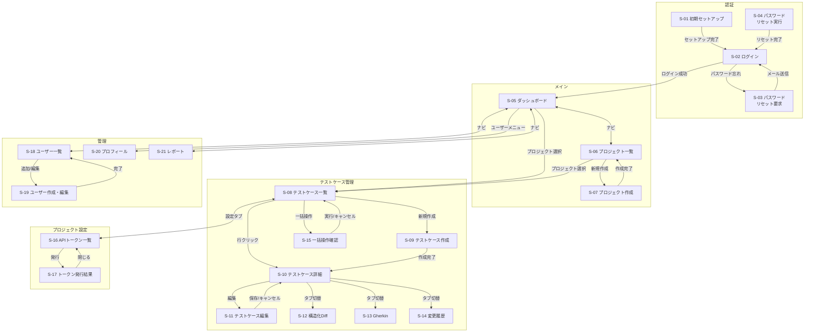

# TMS 画面一覧・画面遷移図

## このドキュメントについて

ユースケース（docs/usecase.md）の全フローを実現するために必要な画面を洗い出し、画面間の遷移関係を定義する。

現設計スペックの UI 定義（§6）は 3 画面のみ（プロジェクト一覧、テストケース一覧、テストケース詳細）。本ドキュメントではユースケースを満たすために必要な全画面を列挙する。API 定義済みだが画面定義が未反映のものは「API定義済み」、設計スペックに未定義の画面は `[※]` で明示する。残る `[※]` は主に MVP 後の拡張機能（ダッシュボード、レポート、セルフサービスパスワードリセット等）に限定される。

---

## 画面一覧

全 21 画面。設計スペック定義済み 10 画面、API定義済み 7 画面、未定義 4 画面。

| ID | 画面名 | 種別 | 対応 UC | スペック |
|---|---|---|---|---|
| S-01 | 初期セットアップ | ページ | UC-02 | API定義済み |
| S-02 | ログイン | ページ | UC-03 | API定義済み |
| S-03 | パスワードリセット要求 | ページ | UC-27 | [※] |
| S-04 | パスワードリセット実行 | ページ | UC-27 | [※] |
| S-05 | ダッシュボード | ページ | UC-22 | [※] |
| S-06 | プロジェクト一覧 | ページ | UC-04, UC-29 | 定義済み |
| S-07 | プロジェクト作成 | ダイアログ | UC-04 | 定義済み(一覧内) |
| S-08 | テストケース一覧 | ページ | UC-07〜12,14,16〜19 | 定義済み |
| S-09 | テストケース作成 | ページ | UC-08, UC-09 | API定義済み |
| S-10 | テストケース詳細 | ページ | UC-10,11,13,15,20,21,28 | 定義済み |
| S-11 | テストケース編集 | ページ内モード | UC-10, UC-13 | 定義済み(詳細内) |
| S-12 | 構造化 Diff ビュー | タブ | UC-15 | 定義済み(詳細内) |
| S-13 | Gherkin ビュー | タブ | UC-20 | 定義済み(詳細内) |
| S-14 | 変更履歴 | タブ | UC-21 | 定義済み(詳細内) |
| S-15 | 一括操作確認 | ダイアログ | UC-12 | API定義済み |
| S-16 | API トークン一覧 | ページ | UC-06, UC-24 | 定義済み |
| S-17 | トークン発行結果 | ダイアログ | UC-06 | 定義済み |
| S-18 | ユーザー一覧 | ページ | UC-05, UC-25 | API定義済み |
| S-19 | ユーザー作成・編集 | ダイアログ | UC-05, UC-25 | API定義済み |
| S-20 | プロフィール・パスワード変更 | ページ | UC-26 | API定義済み |
| S-21 | レポート・エクスポート | ページ | UC-23 | [※] |

**種別の定義:**
- **ページ:** 独立した URL を持つ全画面表示
- **タブ:** 親ページ内のタブ切替で表示
- **ダイアログ:** 親ページ上にオーバーレイ表示。操作完了後に閉じる
- **ページ内モード:** 同一ページの表示/編集モード切替

---

## 共通レイアウト

### グローバルヘッダー `[※]`

全認証済みページに共通のヘッダー。

```
┌─────────────────────────────────────────────────────────────┐
│ TMS ロゴ    [ダッシュボード] [プロジェクト]                  │
│                                    [ユーザー管理(admin)]     │
│                                    ○ 田中太郎 ▼             │
│                                      ├ プロフィール         │
│                                      └ ログアウト           │
└─────────────────────────────────────────────────────────────┘
```

- ナビゲーション: ダッシュボード、プロジェクト一覧
- ユーザー管理リンク（admin ロールのみ表示）
- ユーザーメニュー（プロフィール、ログアウト）

### プロジェクトコンテキストヘッダー `[※]`

プロジェクト配下の画面に表示。プロジェクト内のナビゲーション。

```
┌─────────────────────────────────────────────────────────────┐
│ ← プロジェクト一覧    payment-service                       │
│ [テストケース] [API トークン(admin)] [設定(admin)]           │
└─────────────────────────────────────────────────────────────┘
```

### パンくずリスト `[※]`

現在位置を示す。プロジェクト配下の深い階層で特に必要。

```
プロジェクト > payment-service > テストケース > 有効期限切れカードで決済を試みると...
```

### 通知・トースト `[※]`

操作結果のフィードバック。画面右上に一時表示。

- 成功: 「テストケースを承認しました」「トークンを発行しました」
- エラー: 「更新が競合しました。最新の内容を確認してください」（OCC 409）
- 警告: 「このテストケースを編集すると、以後 Discovery による自動更新が停止します」

---

## 各画面の詳細ドキュメント

各画面のワイヤーフレーム、要素カタログ（data-testid・バリデーション・条件付き表示）、API コール、エラー状態の詳細は `docs/screens/` 配下の個別ドキュメントを参照。

| グループ | ディレクトリ | 画面 |
|---|---|---|
| 認証 | [auth/](./screens/auth/) | S-01 初期セットアップ、S-02 ログイン、S-03〜S-04 パスワードリセット |
| メイン | [main/](./screens/main/) | S-05 ダッシュボード、S-06 プロジェクト一覧、S-07 プロジェクト作成 |
| テストケース管理 | [testcase/](./screens/testcase/) | S-08 一覧、S-09 作成、S-10 詳細、S-11 編集、S-12 構造化Diff、S-13 Gherkin、S-14 変更履歴、S-15 一括操作 |
| プロジェクト設定 | [project-settings/](./screens/project-settings/) | S-16 APIトークン一覧、S-17 トークン発行結果 |
| 管理 | [admin/](./screens/admin/) | S-18 ユーザー一覧、S-19 ユーザー作成・編集、S-20 プロフィール、S-21 レポート |

---

## 画面遷移図

### 全体遷移図



### ユースケース別遷移フロー

#### フロー A：初回導入（UC-02 → UC-06）

```
S-01 初期セットアップ
  ↓ セットアップ完了
S-02 ログイン
  ↓ ログイン成功
S-05 ダッシュボード
  ↓ プロジェクト一覧へ
S-06 プロジェクト一覧
  ↓ 新規作成
S-07 プロジェクト作成ダイアログ
  ↓ 作成完了
S-06 プロジェクト一覧
  ↓ プロジェクト選択
S-08 テストケース一覧
  ↓ 設定タブ
S-16 APIトークン一覧
  ↓ 発行
S-17 トークン発行結果ダイアログ
```

#### フロー B：Discovery 取り込み → レビュー → 承認（UC-07 → UC-11）

```
S-02 ログイン
  ↓
S-05 ダッシュボード（未レビュー: 28件 をクリック）
  ↓
S-08 テストケース一覧（status=draft, ownership=machine でフィルタ済み）
  ↓ テストケース選択
S-10 テストケース詳細（machine 所有の draft）
  ↓ 編集ボタン
S-11 テストケース編集（machine→human 遷移の警告表示）
  ↓ 保存
S-10 テストケース詳細（human 所有に遷移済み）
  ↓ ステータスを approved に変更
S-10 テストケース詳細（approved）
  ↓ ← 一覧に戻る
S-08 テストケース一覧（次のテストケースへ）
```

#### フロー C：drift 検知 → 対応（UC-14 → UC-15）

```
S-05 ダッシュボード（drift: 3件 をクリック）
  ↓
S-08 テストケース一覧（drift=あり でフィルタ済み）
  ↓ テストケース選択
S-10 テストケース詳細（drift バッジ表示）
  ↓ 構造化Diff タブ
S-12 構造化Diffビュー（canonical vs 最新観測の差分表示）
  ↓ 判断分岐
  ├─ コード側が正しい場合: accept-fingerprint → drift 解消 → S-10
  ├─ テスト仕様の更新が必要: S-11 編集 → 保存 → accept-fingerprint → S-10
  └─ コード側がバグ: そのまま S-08 に戻る
```

#### フロー D：stale 検知 → アーカイブ（UC-16）

```
S-05 ダッシュボード（stale: 4件 をクリック）
  ↓
S-08 テストケース一覧（stale=あり でフィルタ済み）
  ↓ テストケース選択
S-10 テストケース詳細（stale バッジ表示、origin ドリルダウン）
  ↓ 判断分岐
  ├─ テスト不要: アーカイブボタン → archived → S-08
  ├─ リネーム: S-08 に戻り新テストケースを探す → 旧をアーカイブ
  └─ 一時的: そのまま S-08 に戻る（次の同期で自動解除を待つ）
```

#### フロー E：一括承認（UC-12）

```
S-08 テストケース一覧
  ↓ フィルタ設定（status=draft, category=normal）
  ↓ 全選択チェックボックス
  ↓ 一括操作メニュー「承認」
S-15 一括操作確認ダイアログ（15件を承認しますか？）
  ↓ 実行
S-08 テストケース一覧（トースト: 15件を承認しました）
```

---

## 設計スペックとの差分

### 画面の API 対応状況

設計スペック §6 の 3 画面に対して追加した画面と、それぞれの API 定義状況。

| 区分 | 追加画面 | 必要性 | API 対応 |
|---|---|---|---|
| **MVP 必須** | S-01 初期セットアップ | 初回の admin 作成手段がない | `POST /api/v1/setup` |
| **MVP 必須** | S-02 ログイン | 認証が存在する以上ログイン画面は必須 | `POST /api/v1/auth/login` |
| **MVP 必須** | S-09 テストケース作成 | 手動登録（UC-08）の UI | `POST .../testcases` |
| **MVP 必須** | S-16 API トークン一覧 | §5.1a で API 定義済みだが UI 導線がない | `GET/POST .../tokens` |
| **MVP 必須** | S-17 トークン発行結果 | 平文の 1 回限り表示に専用 UI が必要 | `POST .../tokens` レスポンス |
| **MVP 必須** | S-18 ユーザー一覧 | User を第一級で持つ以上、管理 UI が必要 | `GET /api/v1/users` |
| **MVP 必須** | S-19 ユーザー作成・編集 | チームメンバーの追加手段がない | `POST/PATCH /api/v1/users` |
| **MVP 推奨** | S-15 一括操作確認 | 大量テストケースの効率的処理 | `POST .../testcases/bulk` |
| **MVP 推奨** | S-20 プロフィール・パスワード変更 | パスワード変更の導線 | `PATCH /api/v1/auth/password` |
| **MVP 後** | S-05 ダッシュボード | 一覧のフィルタで代替可。規模拡大時に必要 | `[※]` UI 専用集計 API 未定義 |
| **MVP 後** | S-21 レポート・エクスポート | 品質メトリクスの可視化 | `[※]` 集計・エクスポート API 未定義 |
| **MVP 後** | S-03, S-04 パスワードリセット | 管理者手動リセットで代替可 | `[※未実装]` `POST .../password-reset-request` |

### 既存画面への機能追加

| 画面 | 追加要素 | 理由 | API 対応 |
|---|---|---|---|
| S-08 テストケース一覧 | 所有権・drift・stale・target フィルタ | ユースケース上不可欠なフィルタ条件 | `GET .../testcases?ownership=&drift=&target=` |
| S-08 テストケース一覧 | チェックボックス + 一括操作バー | 大量取り込み結果の効率的処理 | `POST .../testcases/bulk` |
| S-08 テストケース一覧 | 同期結果サマリー | 再同期後に何が変わったかの把握手段 | `GET .../sync/status` の `last_summary` |
| S-10 テストケース詳細 | Identity 情報タブ | per-origin の stale 状態確認 | `GET .../testcases/:id/identities` |
| S-10 テストケース詳細 | 復帰ボタン（archived → draft） | アーカイブからの復帰操作 | `PATCH .../testcases/:id` (status) |
| S-10 テストケース詳細 | 構造化 Diff | canonical vs 最新観測の差分表示 | `GET .../testcases/:id/diff` |
| S-11 テストケース編集 | machine→human 遷移の警告 | 不可逆遷移の意図しない発動を防止 | `PATCH .../testcases/:id` (ownership) |
| S-12 構造化 Diff ビュー | accept-fingerprint | drift 解消操作 | `POST .../testcases/:id/accept-fingerprint` |
| S-13 Gherkin ビュー | コピー・エクスポートボタン | 仕様書としての共有に必要 | `GET .../testcases/:id?format=gherkin` |

### 共通要素の追加（UI 設計のみ）

API エンドポイント不要の純粋な UI 要素。

| 要素 | 理由 | 状況 |
|---|---|---|
| グローバルヘッダー・ナビゲーション | 画面間の遷移導線 | UI 設計済み |
| プロジェクトコンテキストヘッダー | プロジェクト内のタブナビゲーション | UI 設計済み |
| パンくずリスト | 深い階層での現在位置表示 | UI 設計済み |
| 通知・トースト | 操作結果のフィードバック（成功、OCC 競合、警告） | UI 設計済み |
